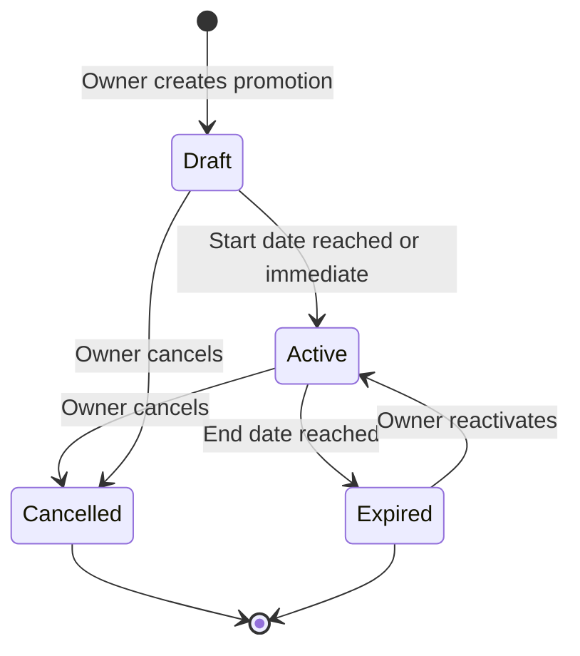
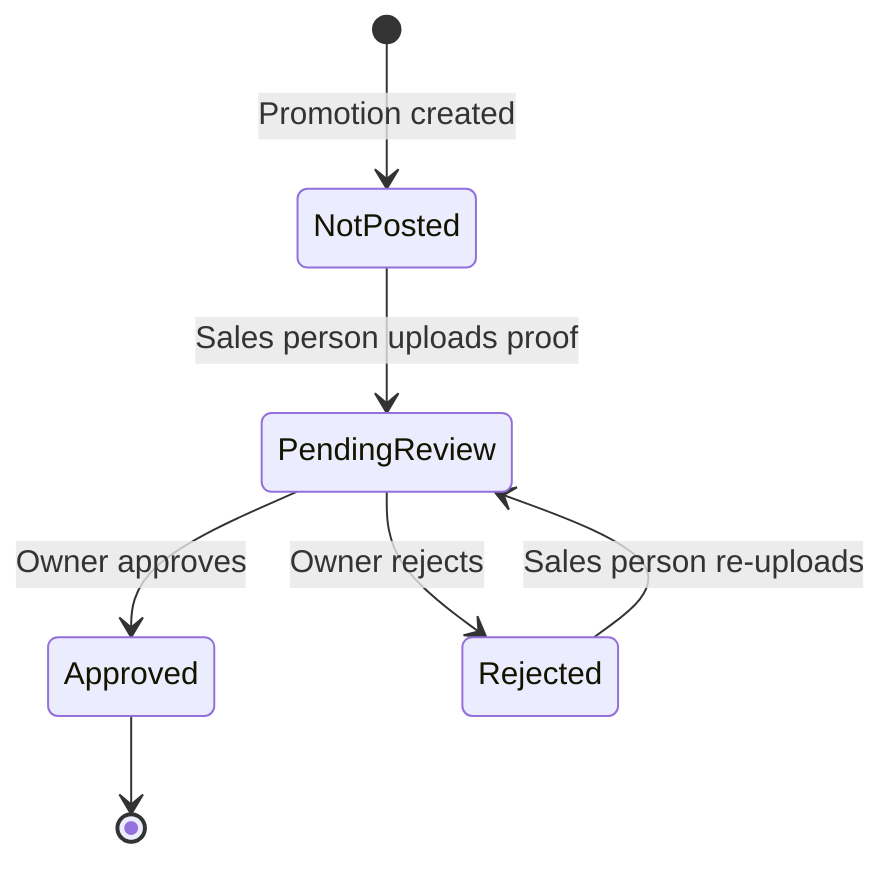

# Core Flows: Product Promotion Management

# Core User Flows

This document defines the complete user journeys for the Product Promotion Management system, covering both Owner and Sales Person roles.

---

## Owner Flows

### Flow 1: Create New Promotion

**Entry Point:** Owner navigates to Sales → Transactions → Product Promotions, clicks "Create Promotion" button

**Steps:**
1. Modal opens with scrollable form containing all fields
2. Owner fills in campaign details:
   - Campaign title (required)
   - Description/notes (optional)
   - Start date (optional) and end date (required)
3. Owner selects products:
   - Clicks "Add Products" button
   - Product picker modal opens with search functionality
   - Owner searches and selects one or multiple products
   - Confirms selection, modal closes
4. Owner sets promotional pricing for each selected product:
   - For each product, sets prices for all tiers (AA, BB, CC, DD, VIP1, VIP2)
   - Can leave tiers blank if not applicable
5. Owner specifies target platforms:
   - Types platform name in text field
   - Clicks "Add Platform" button
   - Platform appears as a chip/tag
   - Repeats for multiple platforms
6. Owner assigns promotion:
   - Selects "All Sales Persons" OR specific staff members from dropdown
7. Owner saves promotion:
   - Clicks "Create Promotion" button
   - Validation occurs (required fields)
   - Success message appears
   - Modal closes, promotion appears in Active tab with "Draft" status

**Exit:** Returns to promotions dashboard, new promotion visible in list

```wireframe
<!DOCTYPE html>
<html>
<head>
<style>
* { margin: 0; padding: 0; box-sizing: border-box; font-family: system-ui, -apple-system, sans-serif; }
body { background: rgba(0,0,0,0.5); display: flex; align-items: center; justify-content: center; min-height: 100vh; padding: 20px; }
.modal { background: white; border-radius: 12px; width: 100%; max-width: 800px; max-height: 90vh; display: flex; flex-direction: column; box-shadow: 0 20px 60px rgba(0,0,0,0.3); }
.modal-header { padding: 24px; border-bottom: 1px solid #e5e7eb; display: flex; justify-content: space-between; align-items: center; }
.modal-header h2 { font-size: 20px; font-weight: 700; color: #1f2937; }
.close-btn { background: none; border: none; font-size: 24px; color: #9ca3af; cursor: pointer; }
.modal-body { padding: 24px; overflow-y: auto; flex: 1; }
.form-section { margin-bottom: 32px; }
.section-title { font-size: 12px; font-weight: 700; color: #6b7280; text-transform: uppercase; letter-spacing: 0.05em; margin-bottom: 16px; }
.form-group { margin-bottom: 16px; }
.form-label { display: block; font-size: 13px; font-weight: 500; color: #374151; margin-bottom: 6px; }
.form-input { width: 100%; padding: 10px 12px; border: 1px solid #d1d5db; border-radius: 8px; font-size: 14px; }
.form-textarea { width: 100%; padding: 10px 12px; border: 1px solid #d1d5db; border-radius: 8px; font-size: 14px; min-height: 80px; resize: vertical; }
.date-row { display: grid; grid-template-columns: 1fr 1fr; gap: 16px; }
.btn-secondary { padding: 10px 16px; border: 1px solid #d1d5db; background: white; border-radius: 8px; font-size: 14px; font-weight: 500; cursor: pointer; display: inline-flex; align-items: center; gap: 8px; }
.btn-secondary:hover { background: #f9fafb; }
.product-list { border: 1px solid #e5e7eb; border-radius: 8px; padding: 12px; min-height: 100px; background: #f9fafb; }
.product-item { background: white; border: 1px solid #e5e7eb; border-radius: 6px; padding: 12px; margin-bottom: 8px; }
.product-header { display: flex; justify-content: between; align-items: center; margin-bottom: 12px; }
.product-name { font-weight: 600; font-size: 14px; color: #1f2937; }
.remove-btn { color: #ef4444; font-size: 12px; cursor: pointer; }
.price-grid { display: grid; grid-template-columns: repeat(3, 1fr); gap: 12px; }
.price-input { padding: 8px; border: 1px solid #d1d5db; border-radius: 6px; font-size: 13px; }
.platform-chips { display: flex; flex-wrap: wrap; gap: 8px; margin-top: 8px; }
.chip { background: #dbeafe; color: #1e40af; padding: 6px 12px; border-radius: 16px; font-size: 13px; display: inline-flex; align-items: center; gap: 6px; }
.chip-remove { cursor: pointer; font-weight: bold; }
.platform-input-row { display: flex; gap: 8px; }
.modal-footer { padding: 24px; border-top: 1px solid #e5e7eb; display: flex; justify-content: flex-end; gap: 12px; }
.btn-cancel { padding: 10px 20px; border: 1px solid #d1d5db; background: white; border-radius: 8px; font-size: 14px; font-weight: 500; cursor: pointer; }
.btn-primary { padding: 10px 24px; background: #2563eb; color: white; border: none; border-radius: 8px; font-size: 14px; font-weight: 600; cursor: pointer; }
.btn-primary:hover { background: #1d4ed8; }
</style>
</head>
<body>
<div class="modal">
  <div class="modal-header">
    <h2>Create New Promotion</h2>
    <button class="close-btn" data-element-id="close-modal">×</button>
  </div>
  <div class="modal-body">
    <div class="form-section">
      <div class="section-title">Campaign Details</div>
      <div class="form-group">
        <label class="form-label">Campaign Title *</label>
        <input type="text" class="form-input" placeholder="e.g., Summer Sale 2024" data-element-id="campaign-title">
      </div>
      <div class="form-group">
        <label class="form-label">Description / Notes</label>
        <textarea class="form-textarea" placeholder="Internal notes about this promotion..." data-element-id="campaign-description"></textarea>
      </div>
      <div class="date-row">
        <div class="form-group">
          <label class="form-label">Start Date (Optional)</label>
          <input type="date" class="form-input" data-element-id="start-date">
        </div>
        <div class="form-group">
          <label class="form-label">End Date *</label>
          <input type="date" class="form-input" data-element-id="end-date">
        </div>
      </div>
    </div>

    <div class="form-section">
      <div class="section-title">Products & Pricing</div>
      <button class="btn-secondary" data-element-id="add-products-btn">
        <span>+</span> Add Products
      </button>
      <div class="product-list">
        <div class="product-item">
          <div class="product-header">
            <span class="product-name">Motul 8100 X-cess 5W40 (Part: MOT-8100)</span>
            <span class="remove-btn" data-element-id="remove-product">Remove</span>
          </div>
          <div class="price-grid">
            <input type="number" class="price-input" placeholder="AA Price" data-element-id="price-aa">
            <input type="number" class="price-input" placeholder="BB Price" data-element-id="price-bb">
            <input type="number" class="price-input" placeholder="CC Price" data-element-id="price-cc">
            <input type="number" class="price-input" placeholder="DD Price" data-element-id="price-dd">
            <input type="number" class="price-input" placeholder="VIP1 Price" data-element-id="price-vip1">
            <input type="number" class="price-input" placeholder="VIP2 Price" data-element-id="price-vip2">
          </div>
        </div>
      </div>
    </div>

    <div class="form-section">
      <div class="section-title">Target Platforms</div>
      <div class="platform-input-row">
        <input type="text" class="form-input" placeholder="Enter platform name" data-element-id="platform-input">
        <button class="btn-secondary" data-element-id="add-platform-btn">Add</button>
      </div>
      <div class="platform-chips">
        <span class="chip">Facebook <span class="chip-remove" data-element-id="remove-platform">×</span></span>
        <span class="chip">Shopee <span class="chip-remove">×</span></span>
        <span class="chip">Instagram <span class="chip-remove">×</span></span>
      </div>
    </div>

    <div class="form-section">
      <div class="section-title">Assignment</div>
      <div class="form-group">
        <label class="form-label">Assign To</label>
        <select class="form-input" data-element-id="assign-to">
          <option>All Sales Persons</option>
          <option>John Doe</option>
          <option>Jane Smith</option>
        </select>
      </div>
    </div>
  </div>
  <div class="modal-footer">
    <button class="btn-cancel" data-element-id="cancel-btn">Cancel</button>
    <button class="btn-primary" data-element-id="create-promotion-btn">Create Promotion</button>
  </div>
</div>
</body>
</html>
```

---

### Flow 2: View & Manage Promotions Dashboard

**Entry Point:** Owner navigates to Sales → Transactions → Product Promotions

**Steps:**
1. Dashboard loads with KPI cards at top:
   - Total Active Promotions
   - Pending Proof Reviews
   - Expiring Soon (within 7 days)
2. Tabbed sections below KPIs:
   - Active tab (default): Shows all active promotions
   - Expired tab: Shows expired promotions
   - Pending Review tab: Shows promotions with proofs awaiting review
3. Each promotion card/row displays:
   - Campaign title
   - Date range
   - Combined status badge (e.g., "Active - 3/5 Posted")
   - Product count
   - Action buttons (View Details, Edit, Extend, Archive)
4. Owner can filter/search promotions
5. Owner can click on any promotion to view details

**Exit:** Stays on dashboard or navigates to detail view

```wireframe
<!DOCTYPE html>
<html>
<head>
<style>
* { margin: 0; padding: 0; box-sizing: border-box; font-family: system-ui, -apple-system, sans-serif; }
body { background: #f8fafc; padding: 24px; }
.header { margin-bottom: 24px; }
.header h1 { font-size: 28px; font-weight: 700; color: #1f2937; margin-bottom: 8px; }
.header p { font-size: 14px; color: #6b7280; }
.kpi-grid { display: grid; grid-template-columns: repeat(3, 1fr); gap: 16px; margin-bottom: 24px; }
.kpi-card { background: white; border: 1px solid #e5e7eb; border-radius: 12px; padding: 20px; }
.kpi-label { font-size: 12px; font-weight: 600; color: #6b7280; text-transform: uppercase; letter-spacing: 0.05em; margin-bottom: 8px; }
.kpi-value { font-size: 32px; font-weight: 700; color: #1f2937; }
.kpi-subtitle { font-size: 13px; color: #9ca3af; margin-top: 4px; }
.main-card { background: white; border: 1px solid #e5e7eb; border-radius: 12px; overflow: hidden; }
.card-header { padding: 20px; border-bottom: 1px solid #e5e7eb; display: flex; justify-content: space-between; align-items: center; }
.tabs { display: flex; gap: 24px; }
.tab { padding: 8px 0; font-size: 14px; font-weight: 500; color: #6b7280; cursor: pointer; border-bottom: 2px solid transparent; }
.tab.active { color: #2563eb; border-bottom-color: #2563eb; }
.btn-create { padding: 10px 20px; background: #2563eb; color: white; border: none; border-radius: 8px; font-size: 14px; font-weight: 600; cursor: pointer; }
.promotion-list { padding: 20px; }
.promotion-item { border: 1px solid #e5e7eb; border-radius: 8px; padding: 16px; margin-bottom: 12px; display: flex; justify-content: space-between; align-items: center; }
.promotion-info { flex: 1; }
.promotion-title { font-size: 16px; font-weight: 600; color: #1f2937; margin-bottom: 4px; }
.promotion-meta { font-size: 13px; color: #6b7280; display: flex; gap: 16px; margin-bottom: 8px; }
.status-badge { display: inline-block; padding: 4px 12px; background: #dbeafe; color: #1e40af; border-radius: 12px; font-size: 12px; font-weight: 600; }
.promotion-actions { display: flex; gap: 8px; }
.action-btn { padding: 8px 16px; border: 1px solid #d1d5db; background: white; border-radius: 6px; font-size: 13px; cursor: pointer; }
.action-btn:hover { background: #f9fafb; }
</style>
</head>
<body>
<div class="header">
  <h1>Product Promotions</h1>
  <p>Manage promotional campaigns and track posting compliance</p>
</div>

<div class="kpi-grid">
  <div class="kpi-card">
    <div class="kpi-label">Active Promotions</div>
    <div class="kpi-value">12</div>
    <div class="kpi-subtitle">Currently running</div>
  </div>
  <div class="kpi-card">
    <div class="kpi-label">Pending Reviews</div>
    <div class="kpi-value">8</div>
    <div class="kpi-subtitle">Proofs awaiting approval</div>
  </div>
  <div class="kpi-card">
    <div class="kpi-label">Expiring Soon</div>
    <div class="kpi-value">3</div>
    <div class="kpi-subtitle">Within 7 days</div>
  </div>
</div>

<div class="main-card">
  <div class="card-header">
    <div class="tabs">
      <div class="tab active" data-element-id="tab-active">Active</div>
      <div class="tab" data-element-id="tab-expired">Expired</div>
      <div class="tab" data-element-id="tab-pending">Pending Review</div>
    </div>
    <button class="btn-create" data-element-id="create-promotion-btn">+ Create Promotion</button>
  </div>
  <div class="promotion-list">
    <div class="promotion-item">
      <div class="promotion-info">
        <div class="promotion-title">Summer Sale 2024</div>
        <div class="promotion-meta">
          <span>📅 Jun 1 - Jun 30</span>
          <span>📦 5 Products</span>
        </div>
        <span class="status-badge" data-element-id="status-badge">Active - 3/5 Posted</span>
      </div>
      <div class="promotion-actions">
        <button class="action-btn" data-element-id="view-details-btn">View Details</button>
        <button class="action-btn" data-element-id="extend-btn">Extend</button>
        <button class="action-btn" data-element-id="edit-btn">Edit</button>
      </div>
    </div>
    <div class="promotion-item">
      <div class="promotion-info">
        <div class="promotion-title">Year-End Clearance</div>
        <div class="promotion-meta">
          <span>📅 Dec 15 - Dec 31</span>
          <span>📦 12 Products</span>
        </div>
        <span class="status-badge">Active - 5/5 Posted</span>
      </div>
      <div class="promotion-actions">
        <button class="action-btn">View Details</button>
        <button class="action-btn">Extend</button>
        <button class="action-btn">Edit</button>
      </div>
    </div>
  </div>
</div>
</body>
</html>
```

---

### Flow 3: Review & Approve/Reject Proofs

**Entry Point:** Owner clicks "View Details" on a promotion OR clicks "Pending Review" tab

**Steps:**
1. Promotion details modal opens with tabs:
   - Overview (campaign details)
   - Proofs (default when opened from Pending Review)
   - Performance
2. Proofs tab shows list of all platform postings:
   - Platform name
   - Sales person who posted
   - Upload date
   - Status (Pending, Approved, Rejected)
   - Screenshot thumbnail
3. Owner clicks on a pending proof to review:
   - Screenshot opens in full view
   - Post URL displayed (if provided)
   - Approve and Reject buttons visible
4. To approve:
   - Owner clicks "Approve" button
   - Proof status changes to "Approved"
   - Sales person receives notification
5. To reject:
   - Owner clicks "Reject" button
   - Rejection reason modal appears (required field)
   - Owner enters reason and confirms
   - Proof status changes to "Rejected"
   - Sales person receives notification with reason

**Exit:** Modal remains open or closes, returning to dashboard

```wireframe
<!DOCTYPE html>
<html>
<head>
<style>
* { margin: 0; padding: 0; box-sizing: border-box; font-family: system-ui, -apple-system, sans-serif; }
body { background: rgba(0,0,0,0.5); display: flex; align-items: center; justify-content: center; min-height: 100vh; padding: 20px; }
.modal { background: white; border-radius: 12px; width: 100%; max-width: 900px; max-height: 90vh; display: flex; flex-direction: column; box-shadow: 0 20px 60px rgba(0,0,0,0.3); }
.modal-header { padding: 24px; border-bottom: 1px solid #e5e7eb; }
.modal-title { font-size: 20px; font-weight: 700; color: #1f2937; margin-bottom: 16px; }
.tabs { display: flex; gap: 24px; border-bottom: 1px solid #e5e7eb; }
.tab { padding: 12px 0; font-size: 14px; font-weight: 500; color: #6b7280; cursor: pointer; border-bottom: 2px solid transparent; margin-bottom: -1px; }
.tab.active { color: #2563eb; border-bottom-color: #2563eb; }
.modal-body { padding: 24px; overflow-y: auto; flex: 1; }
.proof-list { display: grid; gap: 16px; }
.proof-item { border: 1px solid #e5e7eb; border-radius: 8px; padding: 16px; display: flex; gap: 16px; }
.proof-thumbnail { width: 120px; height: 120px; background: #f3f4f6; border-radius: 6px; flex-shrink: 0; display: flex; align-items: center; justify-content: center; font-size: 12px; color: #9ca3af; }
.proof-details { flex: 1; }
.proof-header { display: flex; justify-content: space-between; align-items: start; margin-bottom: 8px; }
.proof-platform { font-size: 16px; font-weight: 600; color: #1f2937; }
.proof-status { padding: 4px 12px; border-radius: 12px; font-size: 12px; font-weight: 600; }
.status-pending { background: #fef3c7; color: #92400e; }
.status-approved { background: #d1fae5; color: #065f46; }
.status-rejected { background: #fee2e2; color: #991b1b; }
.proof-meta { font-size: 13px; color: #6b7280; margin-bottom: 8px; }
.proof-url { font-size: 13px; color: #2563eb; text-decoration: none; }
.proof-actions { display: flex; gap: 8px; margin-top: 12px; }
.btn-approve { padding: 8px 16px; background: #10b981; color: white; border: none; border-radius: 6px; font-size: 13px; font-weight: 500; cursor: pointer; }
.btn-reject { padding: 8px 16px; background: #ef4444; color: white; border: none; border-radius: 6px; font-size: 13px; font-weight: 500; cursor: pointer; }
.btn-view { padding: 8px 16px; border: 1px solid #d1d5db; background: white; border-radius: 6px; font-size: 13px; cursor: pointer; }
</style>
</head>
<body>
<div class="modal">
  <div class="modal-header">
    <div class="modal-title">Summer Sale 2024</div>
    <div class="tabs">
      <div class="tab" data-element-id="tab-overview">Overview</div>
      <div class="tab active" data-element-id="tab-proofs">Proofs</div>
      <div class="tab" data-element-id="tab-performance">Performance</div>
    </div>
  </div>
  <div class="modal-body">
    <div class="proof-list">
      <div class="proof-item">
        <div class="proof-thumbnail">Screenshot Preview</div>
        <div class="proof-details">
          <div class="proof-header">
            <div class="proof-platform">Facebook</div>
            <span class="proof-status status-pending" data-element-id="proof-status">Pending Review</span>
          </div>
          <div class="proof-meta">Posted by John Doe • Uploaded 2 hours ago</div>
          <a href="#" class="proof-url" data-element-id="proof-url">https://facebook.com/post/12345</a>
          <div class="proof-actions">
            <button class="btn-view" data-element-id="view-screenshot-btn">View Full Screenshot</button>
            <button class="btn-approve" data-element-id="approve-btn">✓ Approve</button>
            <button class="btn-reject" data-element-id="reject-btn">✗ Reject</button>
          </div>
        </div>
      </div>
      <div class="proof-item">
        <div class="proof-thumbnail">Screenshot Preview</div>
        <div class="proof-details">
          <div class="proof-header">
            <div class="proof-platform">Shopee</div>
            <span class="proof-status status-approved">Approved</span>
          </div>
          <div class="proof-meta">Posted by Jane Smith • Approved yesterday</div>
          <a href="#" class="proof-url">https://shopee.ph/product/67890</a>
        </div>
      </div>
      <div class="proof-item">
        <div class="proof-thumbnail">Screenshot Preview</div>
        <div class="proof-details">
          <div class="proof-header">
            <div class="proof-platform">Instagram</div>
            <span class="proof-status status-rejected">Rejected</span>
          </div>
          <div class="proof-meta">Posted by John Doe • Rejected 3 days ago</div>
          <div style="font-size: 13px; color: #ef4444; margin-top: 4px;">Reason: Screenshot quality too low, product not visible</div>
        </div>
      </div>
    </div>
  </div>
</div>
</body>
</html>
```

---

### Flow 4: Extend Promotion

**Entry Point:** Owner clicks "Extend" button on a promotion

**Steps:**
1. Extension modal opens showing:
   - Current end date
   - New end date field (pre-filled with +7 days)
   - Optional: Modify promotional prices checkbox
2. Owner sets new end date
3. If "Modify prices" is checked:
   - Price fields appear for all products and tiers
   - Owner can adjust prices
4. Owner clicks "Extend Promotion" button
5. Promotion end date updates
6. If prices were modified, new prices take effect
7. Success message appears
8. Modal closes

**Exit:** Returns to promotions dashboard with updated promotion

---

### Flow 5: View Promotion Performance

**Entry Point:** Owner clicks "View Details" on a promotion, then clicks "Performance" tab

**Steps:**
1. Performance tab displays:
   - Date range of promotion
   - Total sales during promotion period
   - Number of orders
   - Sales breakdown by product
   - Comparison to regular pricing (if available)
2. Data is automatically pulled from sales orders/invoices
3. Owner reviews performance metrics
4. Owner can use this data to decide on extension

**Exit:** Stays in modal or closes to return to dashboard

---

### Flow 6: Handle Expiration Alerts

**Entry Point:** Owner logs in and sees alert widget on main dashboard OR navigates to promotions page

**Steps:**
1. Alert widget on owner's dashboard shows:
   - "3 Promotions Expiring Soon"
   - List of promotion titles with days remaining
   - "View All" button
2. Owner clicks "View All" or navigates to promotions page
3. Promotions page highlights expiring promotions
4. Owner can click on each to view performance and decide:
   - Extend promotion
   - Let it expire
   - Modify and extend
5. Notification bell also shows expiration alerts

**Exit:** Owner takes action or dismisses alerts

---

## Sales Person Flows

### Flow 7: View Assigned Promotions (Dashboard Widget)

**Entry Point:** Sales person logs in, sees dashboard

**Steps:**
1. Dashboard displays promotion widget showing:
   - "5 Active Promotions"
   - "3 Pending Posts" (platforms not yet posted)
   - "View All Promotions" button
2. Widget shows quick summary of posting status
3. Sales person clicks "View All Promotions" to see full list

**Exit:** Navigates to dedicated promotions page

```wireframe
<!DOCTYPE html>
<html>
<head>
<style>
* { margin: 0; padding: 0; box-sizing: border-box; font-family: system-ui, -apple-system, sans-serif; }
body { background: #f8fafc; padding: 24px; }
.dashboard-grid { display: grid; grid-template-columns: repeat(3, 1fr); gap: 16px; }
.widget { background: white; border: 1px solid #e5e7eb; border-radius: 12px; padding: 20px; }
.widget-header { display: flex; align-items: center; gap: 12px; margin-bottom: 16px; }
.widget-icon { width: 40px; height: 40px; background: #dbeafe; border-radius: 10px; display: flex; align-items: center; justify-content: center; font-size: 20px; }
.widget-title { font-size: 14px; font-weight: 600; color: #6b7280; text-transform: uppercase; letter-spacing: 0.05em; }
.widget-stats { margin-bottom: 16px; }
.stat-row { display: flex; justify-content: space-between; align-items: center; padding: 12px 0; border-bottom: 1px solid #f3f4f6; }
.stat-label { font-size: 14px; color: #6b7280; }
.stat-value { font-size: 18px; font-weight: 700; color: #1f2937; }
.widget-action { width: 100%; padding: 10px; background: #2563eb; color: white; border: none; border-radius: 8px; font-size: 14px; font-weight: 600; cursor: pointer; }
.widget-action:hover { background: #1d4ed8; }
</style>
</head>
<body>
<div class="dashboard-grid">
  <div class="widget">
    <div class="widget-header">
      <div class="widget-icon">📢</div>
      <div class="widget-title">Promotions</div>
    </div>
    <div class="widget-stats">
      <div class="stat-row">
        <span class="stat-label">Active Promotions</span>
        <span class="stat-value">5</span>
      </div>
      <div class="stat-row">
        <span class="stat-label">Pending Posts</span>
        <span class="stat-value" style="color: #f59e0b;">3</span>
      </div>
      <div class="stat-row" style="border-bottom: none;">
        <span class="stat-label">Approved Posts</span>
        <span class="stat-value" style="color: #10b981;">12</span>
      </div>
    </div>
    <button class="widget-action" data-element-id="view-all-promotions-btn">View All Promotions</button>
  </div>
  <div class="widget">
    <div class="widget-header">
      <div class="widget-icon">💰</div>
      <div class="widget-title">Monthly Quota</div>
    </div>
    <div class="stat-value" style="font-size: 32px; margin: 16px 0;">₱250,000</div>
  </div>
  <div class="widget">
    <div class="widget-header">
      <div class="widget-icon">📞</div>
      <div class="widget-title">Call List</div>
    </div>
    <div class="stat-value" style="font-size: 32px; margin: 16px 0;">24</div>
  </div>
</div>
</body>
</html>
```

---

### Flow 8: View All Promotions (Dedicated Page)

**Entry Point:** Sales person clicks "View All Promotions" from dashboard widget OR navigates to Sales → Transactions → Product Promotions

**Steps:**
1. Promotions page loads showing list of all visible promotions
2. Each promotion card displays:
   - Campaign title
   - Date range
   - Products included
   - Platform posting status (which platforms posted, which pending)
   - "Upload Proof" buttons for pending platforms
3. Sales person can filter by:
   - Assigned to me
   - All promotions
   - Status (Active, Expired)
4. Sales person clicks on a promotion to see full details

**Exit:** Stays on page or navigates to upload proof flow

```wireframe
<!DOCTYPE html>
<html>
<head>
<style>
* { margin: 0; padding: 0; box-sizing: border-box; font-family: system-ui, -apple-system, sans-serif; }
body { background: #f8fafc; padding: 24px; }
.header { margin-bottom: 24px; }
.header h1 { font-size: 28px; font-weight: 700; color: #1f2937; margin-bottom: 8px; }
.header p { font-size: 14px; color: #6b7280; }
.filters { display: flex; gap: 12px; margin-bottom: 24px; }
.filter-btn { padding: 8px 16px; border: 1px solid #d1d5db; background: white; border-radius: 8px; font-size: 14px; cursor: pointer; }
.filter-btn.active { background: #2563eb; color: white; border-color: #2563eb; }
.promotion-grid { display: grid; gap: 16px; }
.promotion-card { background: white; border: 1px solid #e5e7eb; border-radius: 12px; padding: 20px; }
.promotion-header { margin-bottom: 16px; }
.promotion-title { font-size: 18px; font-weight: 600; color: #1f2937; margin-bottom: 4px; }
.promotion-dates { font-size: 13px; color: #6b7280; }
.promotion-products { margin-bottom: 16px; padding: 12px; background: #f9fafb; border-radius: 8px; }
.products-label { font-size: 12px; font-weight: 600; color: #6b7280; margin-bottom: 8px; }
.product-tag { display: inline-block; padding: 4px 8px; background: white; border: 1px solid #e5e7eb; border-radius: 6px; font-size: 12px; margin-right: 8px; margin-bottom: 4px; }
.platform-section { margin-bottom: 16px; }
.platform-label { font-size: 12px; font-weight: 600; color: #6b7280; margin-bottom: 8px; }
.platform-list { display: flex; flex-wrap: wrap; gap: 8px; }
.platform-item { display: flex; align-items: center; gap: 8px; padding: 8px 12px; background: #f9fafb; border: 1px solid #e5e7eb; border-radius: 8px; font-size: 13px; }
.platform-status { width: 8px; height: 8px; border-radius: 50%; }
.status-pending { background: #f59e0b; }
.status-approved { background: #10b981; }
.status-rejected { background: #ef4444; }
.upload-btn { padding: 8px 16px; background: #2563eb; color: white; border: none; border-radius: 6px; font-size: 13px; font-weight: 500; cursor: pointer; }
</style>
</head>
<body>
<div class="header">
  <h1>Product Promotions</h1>
  <p>View active promotions and upload posting proofs</p>
</div>

<div class="filters">
  <button class="filter-btn active" data-element-id="filter-all">All Promotions</button>
  <button class="filter-btn" data-element-id="filter-assigned">Assigned to Me</button>
  <button class="filter-btn" data-element-id="filter-active">Active Only</button>
</div>

<div class="promotion-grid">
  <div class="promotion-card">
    <div class="promotion-header">
      <div class="promotion-title">Summer Sale 2024</div>
      <div class="promotion-dates">📅 June 1 - June 30, 2024</div>
    </div>
    <div class="promotion-products">
      <div class="products-label">PRODUCTS (5)</div>
      <span class="product-tag">Motul 8100 X-cess</span>
      <span class="product-tag">Brembo Brake Pads</span>
      <span class="product-tag">Denso Spark Plugs</span>
      <span class="product-tag">+2 more</span>
    </div>
    <div class="platform-section">
      <div class="platform-label">POSTING STATUS</div>
      <div class="platform-list">
        <div class="platform-item">
          <span class="platform-status status-approved"></span>
          <span>Facebook</span>
          <span style="font-size: 11px; color: #10b981;">✓ Approved</span>
        </div>
        <div class="platform-item">
          <span class="platform-status status-pending"></span>
          <span>Shopee</span>
          <button class="upload-btn" data-element-id="upload-proof-btn">Upload Proof</button>
        </div>
        <div class="platform-item">
          <span class="platform-status status-rejected"></span>
          <span>Instagram</span>
          <span style="font-size: 11px; color: #ef4444;">✗ Rejected</span>
          <button class="upload-btn" data-element-id="reupload-proof-btn">Re-upload</button>
        </div>
      </div>
    </div>
  </div>
</div>
</body>
</html>
```

---

### Flow 9: Upload Proof for Platform

**Entry Point:** Sales person clicks "Upload Proof" button for a specific platform

**Steps:**
1. Upload modal opens showing:
   - Promotion title and platform name
   - Drag-and-drop zone for screenshot
   - Optional URL field below
   - Submit button
2. Sales person drags screenshot file or clicks to browse
3. File preview appears in drop zone
4. Sales person optionally enters post URL
5. Sales person clicks "Submit Proof" button
6. Upload progress indicator shows
7. Success message appears
8. Proof status changes to "Pending Review"
9. Modal closes

**Exit:** Returns to promotions list with updated status

```wireframe
<!DOCTYPE html>
<html>
<head>
<style>
* { margin: 0; padding: 0; box-sizing: border-box; font-family: system-ui, -apple-system, sans-serif; }
body { background: rgba(0,0,0,0.5); display: flex; align-items: center; justify-content: center; min-height: 100vh; padding: 20px; }
.modal { background: white; border-radius: 12px; width: 100%; max-width: 500px; box-shadow: 0 20px 60px rgba(0,0,0,0.3); }
.modal-header { padding: 24px; border-bottom: 1px solid #e5e7eb; }
.modal-title { font-size: 18px; font-weight: 700; color: #1f2937; margin-bottom: 4px; }
.modal-subtitle { font-size: 14px; color: #6b7280; }
.modal-body { padding: 24px; }
.upload-zone { border: 2px dashed #d1d5db; border-radius: 12px; padding: 40px; text-align: center; background: #f9fafb; cursor: pointer; margin-bottom: 16px; }
.upload-zone:hover { border-color: #2563eb; background: #eff6ff; }
.upload-icon { font-size: 48px; margin-bottom: 12px; }
.upload-text { font-size: 14px; color: #6b7280; margin-bottom: 4px; }
.upload-hint { font-size: 12px; color: #9ca3af; }
.form-group { margin-bottom: 16px; }
.form-label { display: block; font-size: 13px; font-weight: 500; color: #374151; margin-bottom: 6px; }
.form-input { width: 100%; padding: 10px 12px; border: 1px solid #d1d5db; border-radius: 8px; font-size: 14px; }
.modal-footer { padding: 24px; border-top: 1px solid #e5e7eb; display: flex; justify-content: flex-end; gap: 12px; }
.btn-cancel { padding: 10px 20px; border: 1px solid #d1d5db; background: white; border-radius: 8px; font-size: 14px; font-weight: 500; cursor: pointer; }
.btn-submit { padding: 10px 24px; background: #2563eb; color: white; border: none; border-radius: 8px; font-size: 14px; font-weight: 600; cursor: pointer; }
.btn-submit:hover { background: #1d4ed8; }
</style>
</head>
<body>
<div class="modal">
  <div class="modal-header">
    <div class="modal-title">Upload Proof</div>
    <div class="modal-subtitle">Summer Sale 2024 • Shopee</div>
  </div>
  <div class="modal-body">
    <div class="upload-zone" data-element-id="upload-zone">
      <div class="upload-icon">📸</div>
      <div class="upload-text">Drag and drop screenshot here</div>
      <div class="upload-hint">or click to browse (PNG, JPG up to 10MB)</div>
    </div>
    <div class="form-group">
      <label class="form-label">Post URL (Optional)</label>
      <input type="url" class="form-input" placeholder="https://shopee.ph/product/..." data-element-id="post-url-input">
    </div>
  </div>
  <div class="modal-footer">
    <button class="btn-cancel" data-element-id="cancel-btn">Cancel</button>
    <button class="btn-submit" data-element-id="submit-proof-btn">Submit Proof</button>
  </div>
</div>
</body>
</html>
```

---

### Flow 10: Re-upload After Rejection

**Entry Point:** Sales person sees rejected proof, clicks "Re-upload" button

**Steps:**
1. Same upload modal opens as Flow 9
2. Rejection reason is displayed at top of modal in red alert box
3. Sales person uploads new screenshot
4. Sales person optionally updates URL
5. Sales person submits
6. Previous rejected proof is replaced with new pending proof
7. Owner receives notification of new proof to review

**Exit:** Returns to promotions list with "Pending Review" status

---

### Flow 11: View Proof Status

**Entry Point:** Sales person views promotions list

**Steps:**
1. Each platform in promotion card shows status indicator:
   - Green dot + "Approved" = proof accepted
   - Yellow dot + "Pending Review" = awaiting owner approval
   - Red dot + "Rejected" = proof rejected
2. For rejected proofs:
   - Rejection reason is visible on hover or click
   - "Re-upload" button is available
3. For approved proofs:
   - Timestamp of approval shown
   - No further action needed
4. Sales person receives notifications when:
   - New promotion is assigned
   - Proof is approved
   - Proof is rejected (with reason)

**Exit:** Sales person takes appropriate action or continues browsing

---

## Interaction Patterns

### Status Lifecycle



### Proof Review Lifecycle



---

## Key UI Principles

1. **Progressive Disclosure**: Show summary information in lists, detailed information in modals
2. **Status Visibility**: Always show combined status (promotion status + posting progress)
3. **Quick Actions**: Provide action buttons directly in list views for common tasks
4. **Feedback**: Immediate visual feedback for all actions (loading states, success messages)
5. **Notifications**: Use both in-app notifications and dashboard widgets for important alerts
6. **Mobile-Friendly**: All interfaces should work on tablet/mobile devices
7. **Consistent Patterns**: Follow existing UI patterns from Product Database and Sales Person Dashboard

---

## Navigation Structure

```
Sales
└── Transactions
    ├── Sales Inquiry
    ├── Sales Orders
    ├── Order Slips
    ├── Invoices
    └── Product Promotions ← NEW
```

Module ID: `sales-transaction-product-promotions`

---

## Access Control

- **Owner**: Full access (create, edit, delete, review proofs, view performance)
- **Sales Persons**: View assigned/all promotions, upload proofs, view status
- **Managers**: No access (Owner only as specified)

---

## Integration Points

- **Product Database**: Product selection uses existing product search/picker
- **Sales Orders/Invoices**: Performance tracking pulls from these tables
- **Notification System**: Uses existing notification infrastructure
- **Dashboard**: Sales person dashboard widget integrates with existing dashboard layout
- **Topbar Navigation**: New menu item added to Sales → Transactions hierarchy
