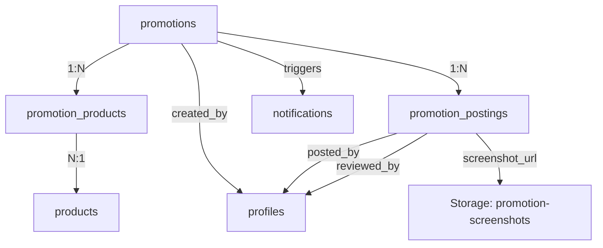
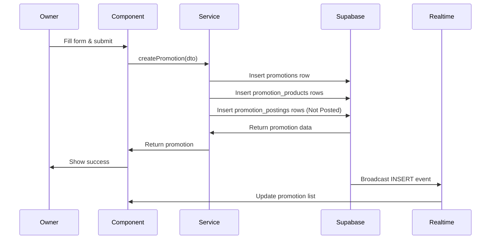
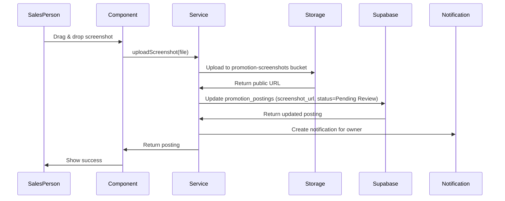
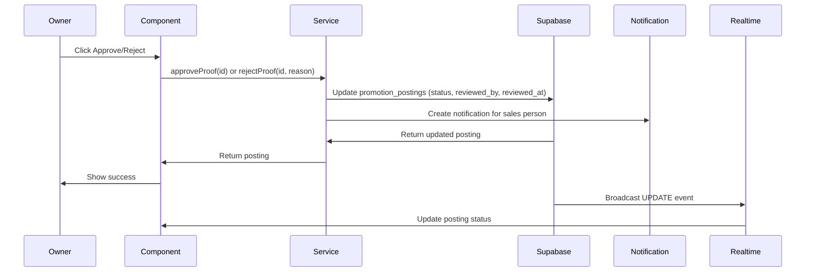

# Tech Plan: Product Promotion Management System

# Technical Architecture Plan

## Architectural Approach

### Core Technology Stack

**Backend**: Supabase (PostgreSQL + Storage + Realtime + Auth)
- Leverages existing infrastructure
- No additional backend services required
- RLS policies for access control

**Frontend**: React 19 + TypeScript + Vite
- Follows existing component patterns
- Direct Supabase queries via service layer
- Real-time subscriptions for live updates

**Storage**: Supabase Storage (Public Bucket)
- New public bucket: `promotion-screenshots`
- Direct upload from browser
- URL-based access (no signed URLs needed)
- File size limit: 10MB per screenshot

### Key Architectural Decisions

**1. Normalized Data Model**
- **Rationale**: Separate tables for `promotions`, `promotion_products`, and `promotion_postings` provide flexibility for querying, updating, and scaling. Aligns with existing patterns (e.g., `sales_orders` + `sales_order_items`).
- **Trade-off**: Requires joins but enables efficient queries and updates of individual products/postings.

**2. Database Triggers for Automation**
- **Rationale**: Expiration alerts generated automatically via PostgreSQL trigger, ensuring timely notifications without external schedulers.
- **Trade-off**: Trigger logic lives in database (harder to test) but guarantees execution without application-level dependencies.

**3. Real-time Aggregation for Performance**
- **Rationale**: Performance data queried on-demand from `sales_orders`/`invoices` tables. Viewed infrequently (only when deciding to extend), so pre-computation overhead not justified.
- **Trade-off**: Slower query but simpler architecture and always accurate.

**4. Real-time Subscriptions**
- **Rationale**: Subscribe to both `promotions` and `promotion_postings` tables for live updates. Owner sees new proofs immediately, sales persons see approvals/rejections immediately.
- **Trade-off**: More subscription overhead but critical for user experience (proof review workflow).

**5. Service Layer Pattern**
- **Rationale**: All database operations encapsulated in services (`promotionService.ts`, `promotionRealtimeService.ts`), consistent with existing codebase patterns.
- **Trade-off**: None - this is the established pattern.

### Integration Points

**Existing Systems**:
- **Notification System** (`file:components/NotificationProvider.tsx`): Reuse for expiration alerts and proof review notifications
- **Product Database** (`file:components/ProductDatabase.tsx`): Product selection uses existing product search
- **Sales Orders/Invoices**: Performance tracking queries these tables
- **RBAC System**: Owner-only access enforced via existing permission checks
- **Sidebar Navigation** (`file:utils/sidebarConfig.ts`): Add new menu item under Sales → Transactions

**New Infrastructure**:
- Supabase Storage bucket (first file upload feature in the system)
- Database trigger for scheduled notifications
- Three new database tables

### Constraints

**Technical**:
- No external schedulers available (database trigger required for timed alerts)
- No existing file upload infrastructure (must implement from scratch)
- Must maintain consistency with existing service/component patterns

**Business**:
- Owner-only access (not Manager)
- Soft delete pattern must be followed
- Real-time updates expected for proof review workflow

---

## Data Model

### Database Schema

#### Table: `promotions`

Main promotion entity with campaign details and status.

```sql
CREATE TABLE promotions (
  id UUID PRIMARY KEY DEFAULT gen_random_uuid(),
  
  -- Campaign Details
  campaign_title TEXT NOT NULL,
  description TEXT,
  
  -- Duration
  start_date TIMESTAMPTZ,  -- NULL = starts immediately
  end_date TIMESTAMPTZ NOT NULL,
  
  -- Status
  status TEXT NOT NULL DEFAULT 'Draft',  -- Draft, Active, Expired, Cancelled
  
  -- Assignment
  created_by UUID NOT NULL REFERENCES profiles(id),
  assigned_to UUID[] DEFAULT '{}',  -- Empty array = all sales persons
  
  -- Target Platforms (array of platform names)
  target_platforms TEXT[] NOT NULL DEFAULT '{}',
  
  -- Audit Fields
  created_at TIMESTAMPTZ NOT NULL DEFAULT NOW(),
  updated_at TIMESTAMPTZ NOT NULL DEFAULT NOW(),
  deleted_at TIMESTAMPTZ,
  is_deleted BOOLEAN NOT NULL DEFAULT FALSE,
  
  -- Constraints
  CONSTRAINT valid_dates CHECK (end_date > COALESCE(start_date, NOW())),
  CONSTRAINT valid_status CHECK (status IN ('Draft', 'Active', 'Expired', 'Cancelled'))
);

-- Indexes
CREATE INDEX idx_promotions_status ON promotions(status) WHERE is_deleted = FALSE;
CREATE INDEX idx_promotions_end_date ON promotions(end_date) WHERE is_deleted = FALSE;
CREATE INDEX idx_promotions_created_by ON promotions(created_by);
```

#### Table: `promotion_products`

Products included in each promotion with tier-specific pricing.

```sql
CREATE TABLE promotion_products (
  id UUID PRIMARY KEY DEFAULT gen_random_uuid(),
  
  -- Relationships
  promotion_id UUID NOT NULL REFERENCES promotions(id) ON DELETE CASCADE,
  product_id UUID NOT NULL REFERENCES products(id),
  
  -- Promotional Pricing (per tier)
  promo_price_aa NUMERIC(10, 2),
  promo_price_bb NUMERIC(10, 2),
  promo_price_cc NUMERIC(10, 2),
  promo_price_dd NUMERIC(10, 2),
  promo_price_vip1 NUMERIC(10, 2),
  promo_price_vip2 NUMERIC(10, 2),
  
  -- Audit
  created_at TIMESTAMPTZ NOT NULL DEFAULT NOW(),
  
  -- Constraints
  UNIQUE(promotion_id, product_id)
);

-- Indexes
CREATE INDEX idx_promotion_products_promotion ON promotion_products(promotion_id);
CREATE INDEX idx_promotion_products_product ON promotion_products(product_id);
```

#### Table: `promotion_postings`

Platform postings with screenshot proofs and review status.

```sql
CREATE TABLE promotion_postings (
  id UUID PRIMARY KEY DEFAULT gen_random_uuid(),
  
  -- Relationships
  promotion_id UUID NOT NULL REFERENCES promotions(id) ON DELETE CASCADE,
  platform_name TEXT NOT NULL,
  
  -- Posting Details
  posted_by UUID REFERENCES profiles(id),
  post_url TEXT,
  screenshot_url TEXT,  -- Supabase Storage URL
  
  -- Review Status
  status TEXT NOT NULL DEFAULT 'Not Posted',  -- Not Posted, Pending Review, Approved, Rejected
  reviewed_by UUID REFERENCES profiles(id),
  reviewed_at TIMESTAMPTZ,
  rejection_reason TEXT,
  
  -- Audit
  created_at TIMESTAMPTZ NOT NULL DEFAULT NOW(),
  updated_at TIMESTAMPTZ NOT NULL DEFAULT NOW(),
  
  -- Constraints
  CONSTRAINT valid_posting_status CHECK (status IN ('Not Posted', 'Pending Review', 'Approved', 'Rejected')),
  CONSTRAINT rejection_reason_required CHECK (
    (status = 'Rejected' AND rejection_reason IS NOT NULL) OR 
    (status != 'Rejected')
  ),
  UNIQUE(promotion_id, platform_name, posted_by)
);

-- Indexes
CREATE INDEX idx_promotion_postings_promotion ON promotion_postings(promotion_id);
CREATE INDEX idx_promotion_postings_status ON promotion_postings(status);
CREATE INDEX idx_promotion_postings_posted_by ON promotion_postings(posted_by);
```

#### Storage Bucket: `promotion-screenshots`

```sql
-- Create public bucket for screenshot storage
INSERT INTO storage.buckets (id, name, public)
VALUES ('promotion-screenshots', 'promotion-screenshots', true);

-- RLS Policy: Anyone authenticated can upload
CREATE POLICY "Authenticated users can upload screenshots"
ON storage.objects FOR INSERT
TO authenticated
WITH CHECK (bucket_id = 'promotion-screenshots');

-- RLS Policy: Anyone can view (public bucket)
CREATE POLICY "Public read access"
ON storage.objects FOR SELECT
TO public
USING (bucket_id = 'promotion-screenshots');

-- RLS Policy: Owner can delete
CREATE POLICY "Owner can delete screenshots"
ON storage.objects FOR DELETE
TO authenticated
USING (
  bucket_id = 'promotion-screenshots' AND
  auth.uid() IN (SELECT id FROM profiles WHERE role = 'Owner')
);
```

### Database Trigger: Expiration Alerts

Automatically create notifications 7 days before promotion expiration.

```sql
-- Function to check and create expiration alerts
CREATE OR REPLACE FUNCTION check_promotion_expiration()
RETURNS void AS $$
DECLARE
  promo RECORD;
  days_until_expiry INTEGER;
BEGIN
  FOR promo IN 
    SELECT id, campaign_title, end_date, created_by
    FROM promotions
    WHERE status = 'Active' 
      AND is_deleted = FALSE
      AND end_date > NOW()
      AND end_date <= NOW() + INTERVAL '7 days'
  LOOP
    days_until_expiry := EXTRACT(DAY FROM promo.end_date - NOW());
    
    -- Check if notification already exists for this promotion
    IF NOT EXISTS (
      SELECT 1 FROM notifications
      WHERE user_id = promo.created_by
        AND type = 'promotion_expiring'
        AND metadata->>'promotion_id' = promo.id::TEXT
        AND created_at > NOW() - INTERVAL '1 day'
    ) THEN
      -- Create notification
      INSERT INTO notifications (user_id, type, title, message, metadata)
      VALUES (
        promo.created_by,
        'promotion_expiring',
        'Promotion Expiring Soon',
        format('"%s" expires in %s days', promo.campaign_title, days_until_expiry),
        jsonb_build_object('promotion_id', promo.id, 'days_remaining', days_until_expiry)
      );
    END IF;
  END LOOP;
END;
$$ LANGUAGE plpgsql;

-- Trigger to run daily (called via pg_cron or manually)
-- Note: pg_cron extension required for automatic scheduling
-- Alternative: Call this function from application on owner dashboard load
```

### Data Relationships



### TypeScript Interfaces

```typescript
// Promotion entity
interface Promotion {
  id: string;
  campaign_title: string;
  description?: string;
  start_date?: string;
  end_date: string;
  status: 'Draft' | 'Active' | 'Expired' | 'Cancelled';
  created_by: string;
  assigned_to: string[];  // Empty = all sales persons
  target_platforms: string[];
  created_at: string;
  updated_at: string;
  deleted_at?: string;
  is_deleted: boolean;
}

// Promotion product with pricing
interface PromotionProduct {
  id: string;
  promotion_id: string;
  product_id: string;
  promo_price_aa?: number;
  promo_price_bb?: number;
  promo_price_cc?: number;
  promo_price_dd?: number;
  promo_price_vip1?: number;
  promo_price_vip2?: number;
  created_at: string;
  // Joined product data
  product?: Product;
}

// Platform posting with proof
interface PromotionPosting {
  id: string;
  promotion_id: string;
  platform_name: string;
  posted_by?: string;
  post_url?: string;
  screenshot_url?: string;
  status: 'Not Posted' | 'Pending Review' | 'Approved' | 'Rejected';
  reviewed_by?: string;
  reviewed_at?: string;
  rejection_reason?: string;
  created_at: string;
  updated_at: string;
}

// DTO for creating promotion
interface CreatePromotionDTO {
  campaign_title: string;
  description?: string;
  start_date?: string;
  end_date: string;
  assigned_to: string[];
  target_platforms: string[];
  products: Array<{
    product_id: string;
    promo_price_aa?: number;
    promo_price_bb?: number;
    promo_price_cc?: number;
    promo_price_dd?: number;
    promo_price_vip1?: number;
    promo_price_vip2?: number;
  }>;
}
```

---

## Component Architecture

### Service Layer

#### `promotionService.ts`

Core CRUD operations for promotions, following existing service patterns.

**Key Functions**:
- `createPromotion(dto: CreatePromotionDTO): Promise<Promotion>`
- `getPromotion(id: string): Promise<Promotion | null>`
- `getAllPromotions(filters?: PromotionFilters): Promise<Promotion[]>`
- `updatePromotion(id: string, updates: Partial<Promotion>): Promise<Promotion>`
- `extendPromotion(id: string, newEndDate: string, priceUpdates?: any): Promise<Promotion>`
- `deletePromotion(id: string): Promise<boolean>` (soft delete with recycle bin)
- `getPromotionProducts(promotionId: string): Promise<PromotionProduct[]>`
- `getPromotionPostings(promotionId: string): Promise<PromotionPosting[]>`
- `uploadScreenshot(file: File, promotionId: string, platform: string): Promise<string>` (returns URL)
- `submitProof(postingId: string, screenshotUrl: string, postUrl?: string): Promise<PromotionPosting>`
- `approveProof(postingId: string): Promise<PromotionPosting>`
- `rejectProof(postingId: string, reason: string): Promise<PromotionPosting>`
- `getPromotionPerformance(promotionId: string): Promise<PerformanceData>`

**Pattern**: Follows `file:services/salesOrderService.ts` structure with proper error handling, authentication checks, and optimistic updates support.

#### `promotionRealtimeService.ts`

Real-time subscription management for live updates.

**Key Functions**:
- `subscribeToPromotions(callbacks: PromotionCallbacks): () => void`
- `subscribeToPromotionPostings(promotionId: string, callbacks: PostingCallbacks): () => void`

**Pattern**: Follows `file:services/salesInquiryRealtimeService.ts` structure with channel management and event handling.

### React Components

#### Owner Components

**`PromotionManagementView.tsx`**
- Main dashboard with KPI cards and tabbed sections
- Uses `useRealtimeList` hook for live promotion updates
- Integrates with existing modal patterns
- Location: `file:components/PromotionManagementView.tsx`

**`CreatePromotionModal.tsx`**
- Scrollable form for creating promotions
- Product picker modal integration
- Platform chip input
- Location: `file:components/CreatePromotionModal.tsx`

**`PromotionDetailsModal.tsx`**
- Tabbed view (Overview, Proofs, Performance)
- Proof review interface
- Performance charts
- Location: `file:components/PromotionDetailsModal.tsx`

**`ExtendPromotionModal.tsx`**
- Simple form for extending end date and updating prices
- Location: `file:components/ExtendPromotionModal.tsx`

#### Sales Person Components

**`PromotionDashboardWidget.tsx`**
- Summary card for sales person dashboard
- Shows active promotions count and pending posts
- Location: `file:components/PromotionDashboardWidget.tsx`

**`PromotionListView.tsx`**
- Full list of promotions with posting status
- Filter by assigned/all
- Location: `file:components/PromotionListView.tsx`

**`UploadProofModal.tsx`**
- Drag-and-drop screenshot upload
- Optional URL field
- Progress indicator
- Location: `file:components/UploadProofModal.tsx`

### Custom Hooks

**`usePromotionList.ts`**
- Wraps `useRealtimeList` for promotions
- Handles filtering and sorting
- Pattern: Similar to existing real-time hooks

**`usePromotionPostings.ts`**
- Real-time subscription to postings for a promotion
- Handles proof status updates

**`useFileUpload.ts`**
- Handles file upload to Supabase Storage
- Progress tracking
- Error handling

### Integration with Existing Systems

**Navigation** (`file:utils/sidebarConfig.ts`):
```typescript
// Add to Sales → Transactions
{
  id: 'sales-transaction-product-promotions',
  label: 'Product Promotions',
  icon: Tag,  // from lucide-react
  level: 3,
  parentId: 'sales-transactions',
  route: 'sales-transaction-product-promotions',
  isExpandable: false,
}
```

**Routing** (`file:App.tsx`):
```typescript
case 'sales-transaction-product-promotions':
  return (
    <div className="h-full overflow-y-auto">
      <PromotionManagementView currentUser={userProfile} />
    </div>
  );
```

**Access Control** (`file:constants.ts`):
```typescript
// Add to AVAILABLE_APP_MODULES
{
  id: 'sales-transaction-product-promotions',
  label: 'Product Promotions',
  category: 'sales'
}
```

**Notifications**:
- Reuse existing `file:components/NotificationProvider.tsx`
- Add new notification types: `promotion_expiring`, `proof_approved`, `proof_rejected`, `promotion_assigned`

### Data Flow Patterns

**Create Promotion Flow**:


**Upload Proof Flow**:


**Approve/Reject Proof Flow**:


### Performance Considerations

**Query Optimization**:
- Indexes on `promotions.status`, `promotions.end_date`, `promotion_postings.status`
- Limit promotion list queries to 100 rows with pagination
- Performance tracking queries filtered by date range and product_id

**Real-time Subscription Management**:
- Subscribe only to active promotions (not expired/cancelled)
- Unsubscribe when component unmounts
- Use channel pooling to avoid excessive connections

**File Upload**:
- Client-side validation (file type, size) before upload
- Direct upload to Supabase Storage (no server proxy)
- Compress images client-side if > 5MB

### Error Handling

**Service Layer**:
- Try-catch blocks with proper error logging
- Return null for not found, throw for errors
- Consistent error messages

**Component Layer**:
- Loading states during async operations
- Error messages displayed to user
- Optimistic updates with rollback on error

**Storage**:
- Handle upload failures gracefully
- Retry logic for network errors
- Clear error messages for file type/size violations

---

## Migration Path

### Phase 1: Database Setup
1. Create tables: `promotions`, `promotion_products`, `promotion_postings`
2. Create storage bucket: `promotion-screenshots`
3. Set up RLS policies
4. Create expiration alert trigger function

### Phase 2: Service Layer
1. Implement `promotionService.ts` with core CRUD operations
2. Implement `promotionRealtimeService.ts` for subscriptions
3. Add file upload utilities

### Phase 3: Owner UI
1. Create `PromotionManagementView` with dashboard
2. Implement creation modal with product picker
3. Add proof review interface
4. Implement extend/edit functionality

### Phase 4: Sales Person UI
1. Add dashboard widget to `SalespersonDashboardView`
2. Create dedicated promotions list page
3. Implement proof upload modal

### Phase 5: Integration
1. Add navigation menu item
2. Add routing in `App.tsx`
3. Register module in RBAC system
4. Test notification delivery

### Phase 6: Testing & Polish
1. Test real-time updates
2. Test file uploads
3. Test performance tracking queries
4. Test expiration alerts
5. Polish UI/UX

---

## References

**Existing Patterns to Follow**:
- Service layer: `file:services/salesOrderService.ts`
- Real-time: `file:services/salesInquiryRealtimeService.ts`
- Component structure: `file:components/ProductDatabase.tsx`
- Dashboard widget: `file:components/SalespersonDashboardView.tsx`
- Notifications: `file:components/NotificationProvider.tsx`

**Database Schema Reference**: `file:database.types.ts`

**Navigation Config**: `file:utils/sidebarConfig.ts`

**Routing**: `file:App.tsx`

**Access Control**: `file:constants.ts`